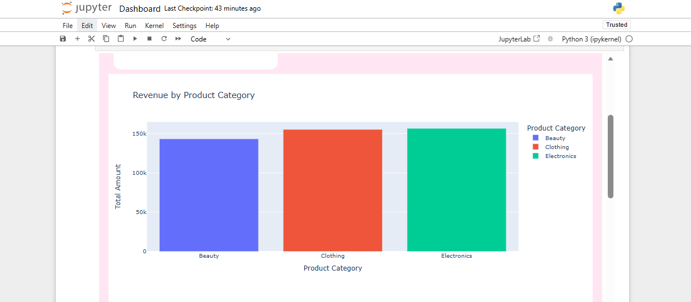
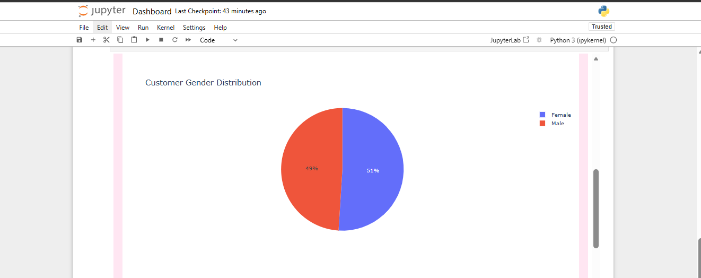
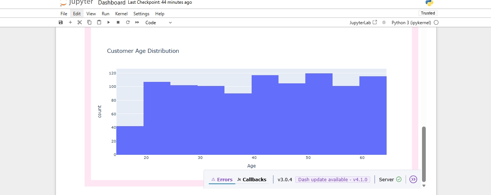

#  PinkGlow Retail Analytics Dashboard

## Project Overview
This project is an end-to-end retail sales analytics solution built using Python and Dash. It analyzes customer behavior, product performance, and revenue trends to generate actionable business insights.

The goal is to demonstrate data cleaning, exploratory data analysis (EDA), and interactive dashboard development.

---

##  Tools & Technologies
- Python
- Pandas
- NumPy
- Plotly Dash
- Matplotlib
- Seaborn

##  Key Features
- Data cleaning and preprocessing
- Exploratory Data Analysis (EDA)
- Interactive dashboard using Dash
- Revenue analysis by product category
- Customer demographic insights (gender, age)
- Monthly sales trend analysis

##  Key Business Insights
- Certain product categories generate significantly higher revenue
- Customer purchases vary across age groups
- Gender distribution shows clear buying patterns
- Sales fluctuate across different months, indicating seasonal trends

##  Dashboard Preview

---

##  How to Run This Project

1. Clone the repository:
bash
git clone https://github.com/tanyachita05/pinkglow-retail-analytics-dashboard.git
