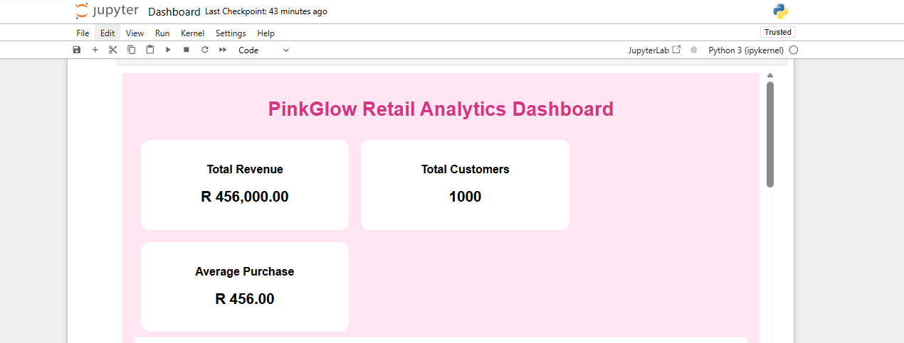

#  Retail Sales Analytics Project (PinkGlow Theme)

##  Overview
This project analyzes retail sales data to understand customer behaviour, product performance, and revenue trends.  
It uses Python and Jupyter Notebook to clean data, explore patterns, and create visual insights.

---

##  Objective
The goal of this project is to:
- Clean and prepare raw retail data
- Perform exploratory data analysis (EDA)
- Identify sales trends and customer patterns
- Present insights using visualizations

---

##  Tools Used
- Python
- Pandas
- NumPy
- Matplotlib
- Seaborn
- Jupyter Notebook

---

##  Project Structure
- Dashboard.ipynb → Main analysis & visualizations
- notebook.ipynb → Data cleaning & exploration
- retail_sales_dataset.csv → Raw dataset
- visuals/ → Charts and images used in analysis

---

##  Key Insights
- Certain product categories generate higher revenue than others
- Customer demographics (age & gender) influence buying behaviour
- Sales patterns show variation across time periods
- Data cleaning improved accuracy of analysis results

---

## 📸 Visual Analysis

### Revenue Analysis


### Gender Distribution


### Age Distribution


### Dashboard Overview


---

##  How to Run This Project
1. Clone this repository:
```bash
##  How to Run This Project


git clone https://github.com/tanyachitaka05/pinkglow-retail-dashboard.git
